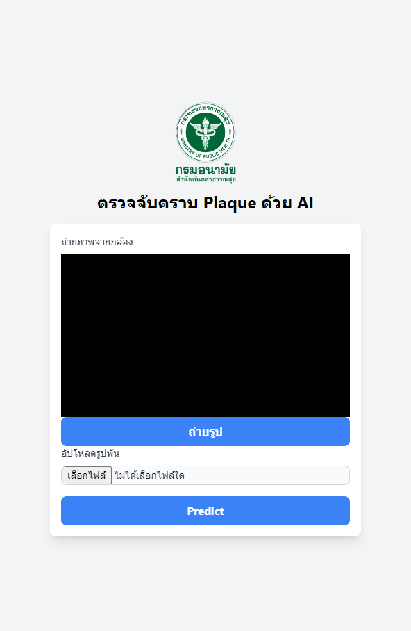

# Dental Plaque Detection with AI

This is a web application for detecting dental plaque using AI. The app allows users to upload an image of teeth or capture a photo with their webcam, and then it sends the image to the Roboflow inference server for dental plaque segmentation.

## Features

- Upload images or capture photos directly using a webcam.
- Convert captured or uploaded images to base64 format for easy submission.
- Send the images to the Roboflow API for AI-based dental plaque segmentation.
- Display a loading spinner while the AI is processing the image.
- Show prediction results by replacing the original image with the result.

## Demo

